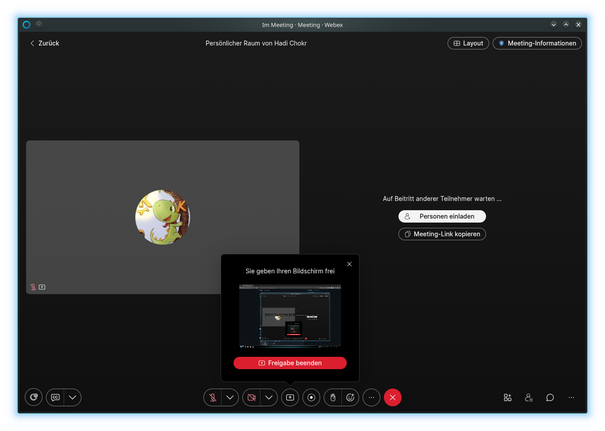

#  Webex Web

> *A working Linux client for Webex – because the official app is broken.*

Webex in its own window, with desktop Integration. Built with Electron.

> **This is an unofficial project. It is not made by, affiliated with, endorsed by, sponsored by, or connected to Cisco in any way.**
>
> "Webex" and the Webex logo are trademarks of Cisco Systems, Inc. This app only wraps the public web client (web.webex.com) in a window — it ships no Cisco code, assets, or branding, and the icon is an original mark, not Cisco's logo. If you want the official client, get it from Cisco.

## Install

    flatpak remote-add --if-not-exists webexweb \
      https://silverhadch.github.io/io.github.silverhadch.WebexWeb/index.flatpakrepo
    flatpak install webexweb io.github.silverhadch.WebexWeb

## Build locally

    flatpak install -y flathub org.flatpak.Builder
    flatpak install -y flathub \
      org.freedesktop.Platform//25.08 \
      org.freedesktop.Sdk//25.08 \
      org.electronjs.Electron2.BaseApp//25.08

    flatpak run org.flatpak.Builder --user --install --force-clean \
      build-dir io.github.silverhadch.WebexWeb.yaml

    flatpak run io.github.silverhadch.WebexWeb

## License

MIT. See [LICENSE](LICENSE).
